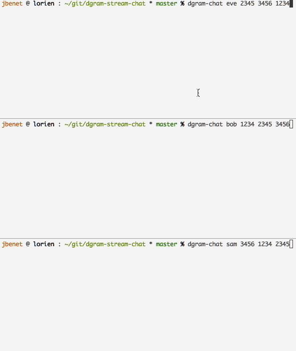

# dgram-stream-example-chat

This module shows you how to use dgram stream to:

- use [dgram-stream](http://github.com/jbenet/dgram-stream)
- build [a module to be imported](index.js) with [duplex-transform](http://github.com/jbenet/node-duplex-transform)
- use your module in another app

## Do it!

```
# install it
npm install -g dgram-stream-example-chat

# run it in three different terminals
dgram-chat eve 1234 2345 3456
dgram-chat bob 2345 3456 1234
dgram-chat sam 3456 2345 1234
```

## See it!


